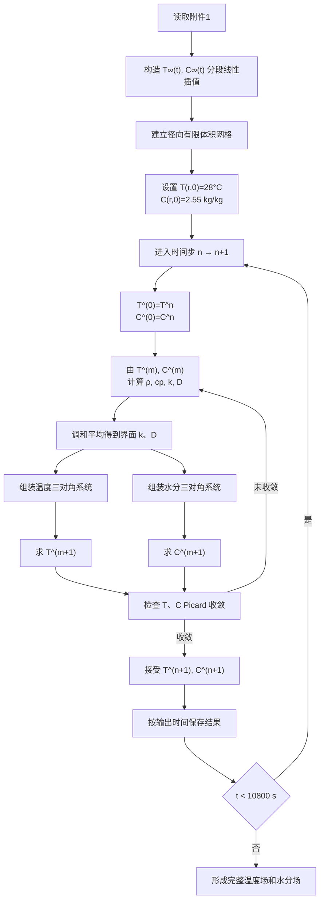

# A题问题二：融合型温度—水分双向耦合全流程数学模型

## 1. 问题定义

药材近似为长

$$
L=25\ \mathrm{cm}
$$

、半径

$$
R=2\ \mathrm{cm}
$$

的圆柱体。烘干初始时刻为

$$
T(r,0)=28^\circ\mathrm C,
\qquad
C(r,0)=2.55\ \mathrm{kg/kg}.
$$

问题二要求建立整个烘干过程中药材内部温度场

$$
T(r,t)
$$

和干基含水率场

$$
C(r,t)
$$

的变化模型，并统一使用附录 3 给出的状态相关经验公式。

计算区间为

$$
0\le t\le10800\ \mathrm s,
\qquad
0\le r\le0.02\ \mathrm m.
$$

附件 1 中烘房环境数据覆盖 $0\sim14400\ \mathrm s$，因此问题二前三小时的计算区间全部位于附件数据范围内。

---

## 2. 模型结构

该模型由以下部分组成：

| 模型环节 | 采用形式 |
|---|---|
| 几何模型 | 固定半径圆柱一维径向模型 |
| 温度控制方程 | 变物性非稳态 Fourier 导热方程 |
| 水分控制方程 | 变扩散系数 Fick 扩散方程 |
| 中心边界 | 轴对称零通量条件 |
| 表面热边界 | Newton 对流换热 Robin 边界 |
| 表面水分边界 | 对流传质 Robin 边界 |
| 外部环境数据 | 附件 1 分段线性插值 |
| 空间离散 | 圆柱径向有限体积法 |
| 界面物性 | 调和平均 |
| 时间离散 | 后向欧拉 |
| 非线性耦合 | 同状态块 Picard 迭代 |
| 线性系统 | 三对角线性方程组直接求解 |

---

## 3. 模型假设

1. 药材视为均匀、各向同性的规则圆柱体。

2. 仅考虑径向温度和水分变化，忽略轴向梯度。

3. 问题二中药材半径保持

$$
R=0.02\ \mathrm m
$$

不变，不考虑尺寸收缩。

4. 初始温度和初始干基含水率在整个径向上均匀分布。

5. 药材内部复杂孔隙结构和不同形态水分的迁移统一用题目给出的有效扩散系数 $D(T,C)$ 表示。

6. 密度、比热容、导热系数和水分扩散系数由局部当前状态决定。

7. 烘房环境在药材圆柱侧表面上均匀分布。

8. 表面对流换热系数和对流传质系数采用

$$
h=25\ \mathrm{W/(m^2\,K)},
$$

$$
h_m=8\times10^{-7}\ \mathrm{m/s}.
$$

9. 附件 1 中的烘房水分浓度直接作为表面对流传质边界中的外部有效水分浓度

$$
C_\infty(t).
$$

10. 模型不包含蒸发潜热、辐射换热、内部热源、化学反应和相变动力学。

11. 温度方程的局部储热项采用

$$
\rho(C)c_p(C)\frac{\partial T}{\partial t},
$$

不展开为包含物性时间导数的其他形式。

---

## 4. 变量与参数

| 符号 | 含义 | 单位 |
|---|---|---|
| $r$ | 距圆柱中心轴的径向距离 | m |
| $R$ | 药材半径 | m |
| $L$ | 药材长度 | m |
| $t$ | 时间 | s |
| $T(r,t)$ | 药材内部温度 | °C |
| $T_K(r,t)$ | 药材绝对温度 | K |
| $C(r,t)$ | 药材干基含水率 | kg/kg |
| $T_\infty(t)$ | 烘房温度 | °C |
| $C_\infty(t)$ | 烘房水分浓度 | kg/kg |
| $\rho(C)$ | 密度 | kg/m³ |
| $c_p(C)$ | 比热容 | J/(kg·K) |
| $k(C)$ | 导热系数 | W/(m·K) |
| $D(T,C)$ | 有效水分扩散系数 | m²/s |
| $h$ | 对流换热系数 | W/(m²·K) |
| $h_m$ | 对流传质系数 | m/s |

---

## 5. 烘房环境边界数据

附件 1 给出离散时刻的烘房温度和水分浓度。

对任一环境变量 $y(t)$，在相邻数据点

$$
(t_j,y_j),
\qquad
(t_{j+1},y_{j+1})
$$

之间采用分段线性插值：

$$
y(t)
=
y_j+
\frac{y_{j+1}-y_j}{t_{j+1}-t_j}
(t-t_j),
\qquad
t_j\le t\le t_{j+1}.
$$

由此分别得到

$$
T_\infty(t),
\qquad
C_\infty(t).
$$

在从 $t^n$ 推进至 $t^{n+1}$ 时，边界项使用

$$
T_\infty(t^{n+1}),
\qquad
C_\infty(t^{n+1}).
$$

---

## 6. 附录 3 状态相关物性

密度为

$$
\rho(C)=650+128C.
$$

比热容为

$$
c_p(C)
=
1450+2736\frac{C}{C+1}.
$$

导热系数为

$$
k(C)
=
0.21+0.38\frac{C}{C+1}.
$$

水分扩散系数为

$$
D(T,C)
=
2.4\times10^{-3}
\exp\left(-\frac{0.45}{C}\right)
\exp\left(-\frac{3850}{T_K}\right).
$$

其中

$$
T_K=T+273.15.
$$

因此 $D$ 的计算使用绝对温度 Kelvin，温度场本身可以用摄氏度保存和输出。

由这些经验式形成以下状态依赖关系：

$$
C
\rightarrow
\rho(C),c_p(C),k(C)
\rightarrow
T,
$$

以及

$$
T,C
\rightarrow
D(T,C)
\rightarrow
C.
$$

整体关系可写为

$$
C
\rightarrow
(\rho,c_p,k)
\rightarrow
T
\rightarrow
D
\rightarrow
C.
$$

---

## 7. 温度控制方程

在轴对称圆柱坐标系中，温度满足

$$
\rho(C)c_p(C)
\frac{\partial T}{\partial t}
=
\frac{1}{r}
\frac{\partial}{\partial r}
\left[
rk(C)
\frac{\partial T}{\partial r}
\right],
\qquad
0<r<R.
$$

左端表示局部储热项，右端表示径向导热通量的散度。

由于

$$
\rho=\rho(C),
\qquad
c_p=c_p(C),
\qquad
k=k(C),
$$

温度方程属于状态相关变系数非线性扩散方程。

---

## 8. 水分控制方程

干基含水率满足

$$
\frac{\partial C}{\partial t}
=
\frac{1}{r}
\frac{\partial}{\partial r}
\left[
rD(T,C)
\frac{\partial C}{\partial r}
\right],
\qquad
0<r<R.
$$

左端表示局部水分含量随时间的变化，右端表示径向扩散通量的散度。

由于

$$
D=D(T,C),
$$

水分方程同时依赖温度场和含水率场。

---

## 9. 初始条件

初始温度为

$$
T(r,0)=28^\circ\mathrm C,
\qquad
0\le r\le R.
$$

初始含水率为

$$
C(r,0)=2.55\ \mathrm{kg/kg},
\qquad
0\le r\le R.
$$

---

## 10. 中心轴边界条件

由于圆柱中心具有轴对称性，

$$
\left.
\frac{\partial T}{\partial r}
\right|_{r=0}
=0,
$$

$$
\left.
\frac{\partial C}{\partial r}
\right|_{r=0}
=0.
$$

对应中心处热通量和水分通量均为零。

---

## 11. 表面对流边界条件

### 11.1 温度边界

在药材表面 $r=R$：

$$
-k(C_s)
\left.
\frac{\partial T}{\partial r}
\right|_{r=R}
=
h
\left[
T_s-T_\infty(t)
\right],
$$

其中

$$
T_s=T(R,t),
\qquad
C_s=C(R,t).
$$

等价写为

$$
k(C_s)
\left.
\frac{\partial T}{\partial r}
\right|_{r=R}
=
h
\left[
T_\infty(t)-T_s
\right].
$$

---

### 11.2 水分边界

在药材表面：

$$
-D(T_s,C_s)
\left.
\frac{\partial C}{\partial r}
\right|_{r=R}
=
h_m
\left[
C_s-C_\infty(t)
\right].
$$

等价写为

$$
D(T_s,C_s)
\left.
\frac{\partial C}{\partial r}
\right|_{r=R}
=
h_m
\left[
C_\infty(t)-C_s
\right].
$$

---

# 12. 空间离散

## 12.1 径向有限体积网格

取径向步长

$$
\Delta r
=
5\times10^{-5}\ \mathrm m
=
0.005\ \mathrm{cm}.
$$

径向节点定义为

$$
r_i=i\Delta r,
\qquad
i=0,1,\ldots,N.
$$

其中

$$
N=\frac{R}{\Delta r}=400.
$$

因此共有

$$
401
$$

个径向节点。

节点包括

$$
r_0=0
$$

和

$$
r_N=R.
$$

---

## 12.2 控制体几何量

内部节点的左右控制体面为

$$
r_{i-\frac12}
=
r_i-\frac{\Delta r}{2},
$$

$$
r_{i+\frac12}
=
r_i+\frac{\Delta r}{2}.
$$

除去圆柱积分中的公共因子 $2\pi L$，第 $i$ 个控制体的径向体积测度为

$$
V_i
=
\int_{r_{i-\frac12}}^{r_{i+\frac12}}r\,dr
=
\frac{
r_{i+\frac12}^2-r_{i-\frac12}^2
}{2}.
$$

中心节点与表面节点均采用半控制体。

中心位置：

$$
r_{-\frac12}=0.
$$

表面位置：

$$
r_{N+\frac12}=R.
$$

---

# 13. 界面物性

相邻节点 $i$ 与 $i+1$ 之间的界面导热系数采用调和平均：

$$
k_{i+\frac12}
=
\frac{
2k_i k_{i+1}
}{
k_i+k_{i+1}
}.
$$

界面水分扩散系数为

$$
D_{i+\frac12}
=
\frac{
2D_iD_{i+1}
}{
D_i+D_{i+1}
}.
$$

相应的径向导热通量系数为

$$
G^T_{i+\frac12}
=
k_{i+\frac12}
\frac{r_{i+\frac12}}{\Delta r},
$$

水分扩散通量系数为

$$
G^C_{i+\frac12}
=
D_{i+\frac12}
\frac{r_{i+\frac12}}{\Delta r}.
$$

调和平均可由两个半网格区间的串联传递阻力得到。

对于导热：

$$
R_T
=
\frac{\Delta r/2}{k_i}
+
\frac{\Delta r/2}{k_{i+1}}.
$$

定义等效界面导热系数满足

$$
R_T
=
\frac{\Delta r}{k_{i+\frac12}},
$$

可得

$$
k_{i+\frac12}
=
\frac{2k_ik_{i+1}}{k_i+k_{i+1}}.
$$

扩散系数 $D$ 的推导相同。

---

# 14. 时间离散

采用固定时间步

$$
\Delta t=0.5\ \mathrm s.
$$

时间节点为

$$
t^n=n\Delta t.
$$

时间导数采用后向欧拉：

$$
\frac{\partial T}{\partial t}
\approx
\frac{
T_i^{n+1}-T_i^n
}{
\Delta t
},
$$

$$
\frac{\partial C}{\partial t}
\approx
\frac{
C_i^{n+1}-C_i^n
}{
\Delta t
}.
$$

新时刻的空间通量统一使用 $n+1$ 时刻的未知场，因此形成全隐式离散。

---

# 15. 温度方程的有限体积离散

在某一 Picard 迭代中，暂时固定

$$
\rho_i,\qquad
c_{p,i},\qquad
k_i.
$$

对于内部控制体 $i$：

$$
(\rho c_p)_iV_i
\frac{
T_i^{n+1}-T_i^n
}{
\Delta t
}
=
G^T_{i+\frac12}
\left(
T_{i+1}^{n+1}-T_i^{n+1}
\right)
-
G^T_{i-\frac12}
\left(
T_i^{n+1}-T_{i-1}^{n+1}
\right).
$$

整理得到

$$
a_{P,i}^TT_i^{n+1}
=
a_{W,i}^TT_{i-1}^{n+1}
+
a_{E,i}^TT_{i+1}^{n+1}
+
b_i^T.
$$

其中

$$
a_{W,i}^T
=
\Delta tG^T_{i-\frac12},
$$

$$
a_{E,i}^T
=
\Delta tG^T_{i+\frac12},
$$

$$
a_{P,i}^T
=
(\rho c_p)_iV_i
+
a_{W,i}^T
+
a_{E,i}^T,
$$

$$
b_i^T
=
(\rho c_p)_iV_iT_i^n.
$$

---

# 16. 水分方程的有限体积离散

固定当前 Picard 迭代中的

$$
D_i=D(T_i,C_i).
$$

对于内部控制体：

$$
V_i
\frac{
C_i^{n+1}-C_i^n
}{
\Delta t
}
=
G^C_{i+\frac12}
\left(
C_{i+1}^{n+1}-C_i^{n+1}
\right)
-
G^C_{i-\frac12}
\left(
C_i^{n+1}-C_{i-1}^{n+1}
\right).
$$

整理为

$$
a_{P,i}^CC_i^{n+1}
=
a_{W,i}^CC_{i-1}^{n+1}
+
a_{E,i}^CC_{i+1}^{n+1}
+
b_i^C.
$$

其中

$$
a_{W,i}^C
=
\Delta tG^C_{i-\frac12},
$$

$$
a_{E,i}^C
=
\Delta tG^C_{i+\frac12},
$$

$$
a_{P,i}^C
=
V_i
+
a_{W,i}^C
+
a_{E,i}^C,
$$

$$
b_i^C
=
V_iC_i^n.
$$

---

# 17. 中心节点离散

中心节点

$$
r_0=0
$$

处的内侧控制体面半径为零，因此

$$
G^T_{-\frac12}=0,
\qquad
G^C_{-\frac12}=0.
$$

由有限体积几何关系直接得到中心零通量条件，无需计算 $1/r$。

---

# 18. 表面节点离散

## 18.1 温度表面节点

最外侧控制体满足

$$
(\rho c_p)_NV_N
\frac{
T_N^{n+1}-T_N^n
}{
\Delta t
}
=
G^T_{N-\frac12}
\left(
T_{N-1}^{n+1}-T_N^{n+1}
\right)
+
Rh
\left[
T_\infty^{n+1}-T_N^{n+1}
\right].
$$

对应矩阵系数增加

$$
a_{P,N}^T
\leftarrow
a_{P,N}^T
+
\Delta tRh,
$$

右端增加

$$
b_N^T
\leftarrow
b_N^T
+
\Delta tRhT_\infty^{n+1}.
$$

---

## 18.2 水分表面节点

最外侧水分控制体满足

$$
V_N
\frac{
C_N^{n+1}-C_N^n
}{
\Delta t
}
=
G^C_{N-\frac12}
\left(
C_{N-1}^{n+1}-C_N^{n+1}
\right)
+
Rh_m
\left[
C_\infty^{n+1}-C_N^{n+1}
\right].
$$

对应

$$
a_{P,N}^C
\leftarrow
a_{P,N}^C
+
\Delta tRh_m,
$$

$$
b_N^C
\leftarrow
b_N^C
+
\Delta tRh_mC_\infty^{n+1}.
$$

---

# 19. 非线性耦合求解

由于

$$
\rho=\rho(C),
$$

$$
c_p=c_p(C),
$$

$$
k=k(C),
$$

$$
D=D(T,C),
$$

每个新时间层的系数均依赖未知的 $T^{n+1},C^{n+1}$。

因此在每个时间步内部进行 Picard 固定点迭代。

---

## 19.1 Picard 初值

从已知时间层 $n$ 出发：

$$
T^{(0)}=T^n,
$$

$$
C^{(0)}=C^n.
$$

---

## 19.2 第 $m$ 次迭代

根据同一组当前状态

$$
T^{(m)},C^{(m)}
$$

计算

$$
\rho^{(m)}
=
\rho(C^{(m)}),
$$

$$
c_p^{(m)}
=
c_p(C^{(m)}),
$$

$$
k^{(m)}
=
k(C^{(m)}),
$$

$$
D^{(m)}
=
D(T^{(m)},C^{(m)}).
$$

再计算全部界面物性

$$
k_{i+\frac12}^{(m)},
\qquad
D_{i+\frac12}^{(m)}.
$$

在这一轮中冻结上述系数，分别建立并求解温度与水分三对角系统：

$$
T^{(m+1)}
=
\mathcal F_T
\left(
T^n;
\rho^{(m)},
c_p^{(m)},
k^{(m)}
\right),
$$

$$
C^{(m+1)}
=
\mathcal F_C
\left(
C^n;
D^{(m)}
\right).
$$

两场均求解完成后，共同进入下一轮物性更新。

该过程持续到 $T,C$ 同时满足收敛条件。

---

## 19.3 收敛判据

温度最大模变化量定义为

$$
\varepsilon_T^{(m)}
=
\max_i
\left|
T_i^{(m+1)}-T_i^{(m)}
\right|.
$$

水分最大模变化量定义为

$$
\varepsilon_C^{(m)}
=
\max_i
\left|
C_i^{(m+1)}-C_i^{(m)}
\right|.
$$

计算中可设置

$$
\varepsilon_T
\le10^{-8}\ ^\circ\mathrm C,
$$

$$
\varepsilon_C
\le10^{-10}\ \mathrm{kg/kg}.
$$

单个时间步最大 Picard 迭代次数设置为

$$
50.
$$

若达到最大迭代次数仍未满足收敛条件，则记录该时间步为非线性迭代失败，不继续将该步视为正常收敛结果。

---

# 20. 三对角线性系统

无论温度方程还是水分方程，有限体积离散后都只涉及

$$
i-1,\quad i,\quad i+1
$$

三个相邻节点。

因此矩阵形式为

$$
A\mathbf x=\mathbf b,
$$

其中 $A$ 为三对角矩阵。

温度方程：

$$
A_T\mathbf T^{(m+1)}
=
\mathbf b_T.
$$

水分方程：

$$
A_C\mathbf C^{(m+1)}
=
\mathbf b_C.
$$

可采用三对角直接算法或带状矩阵直接求解器求解。

---

# 21. 完整计算流程

对应计算顺序为：

1. 读取附件 1；
2. 构造 $T_\infty(t),C_\infty(t)$；
3. 建立径向有限体积网格；
4. 设置初始温度和含水率；
5. 进入下一时间步；
6. 使用上一时间层状态初始化 Picard；
7. 根据当前 $T,C$ 更新 $\rho,c_p,k,D$；
8. 计算界面调和平均；
9. 组装温度和水分线性系统；
10. 分别求解新的温度场和水分场；
11. 判断 Picard 收敛；
12. 未收敛则更新当前状态继续迭代；
13. 收敛后接受新的时间层；
14. 保存题目要求的时间和径向节点数据；
15. 重复至 $10800\ \mathrm s$。

---

# 22. 基准计算参数

| 项目 | 数值 |
|---|---:|
| 半径 $R$ | $0.02\ \mathrm m$ |
| 长度 $L$ | $0.25\ \mathrm m$ |
| 径向步长 $\Delta r$ | $5\times10^{-5}\ \mathrm m$ |
| 径向节点数 | 401 |
| 时间步长 $\Delta t$ | $0.5\ \mathrm s$ |
| 计算时间范围 | $0\sim10800\ \mathrm s$ |
| 空间离散 | 有限体积 |
| 时间离散 | 后向欧拉 |
| 界面物性 | 调和平均 |
| 非线性迭代 | 同状态块 Picard |
| 温度收敛阈值 | $10^{-8}\ ^\circ\mathrm C$ |
| 水分收敛阈值 | $10^{-10}\ \mathrm{kg/kg}$ |
| 单步最大 Picard 次数 | 50 |

---

# 23. 初始状态下的特征量

在

$$
C_0=2.55,
\qquad
T_0=28^\circ\mathrm C=301.15\ \mathrm K
$$

时：

$$
\rho_0
=
650+128\times2.55
=
976.4\ \mathrm{kg/m^3}.
$$

$$
c_{p,0}
=
1450+
2736\frac{2.55}{3.55}
\approx3415.30\ \mathrm{J/(kg\,K)}.
$$

$$
k_0
=
0.21+
0.38\frac{2.55}{3.55}
\approx0.48296\ \mathrm{W/(m\,K)}.
$$

水分扩散系数为

$$
D_0
=
2.4\times10^{-3}
e^{-0.45/2.55}
e^{-3850/301.15}
\approx5.64\times10^{-9}\ \mathrm{m^2/s}.
$$

对应热扩散率

$$
\alpha_0
=
\frac{k_0}{\rho_0c_{p,0}}
\approx
1.45\times10^{-7}\ \mathrm{m^2/s}.
$$

二者比值约为

$$
\frac{\alpha_0}{D_0}
\approx25.7.
$$

若用

$$
\tau\sim\frac{R^2}{\text{扩散系数}}
$$

估算特征时间，则初始热扩散特征时间约为

$$
\tau_T
\approx
\frac{(0.02)^2}{1.45\times10^{-7}}
\approx
2.76\times10^3\ \mathrm s
\approx0.77\ \mathrm h,
$$

初始水分扩散特征时间约为

$$
\tau_C
\approx
\frac{(0.02)^2}{5.64\times10^{-9}}
\approx
7.09\times10^4\ \mathrm s
\approx19.7\ \mathrm h.
$$

上述计算只基于初始状态，用于描述两个扩散过程在初始物性下的时间尺度量级；实际过程中 $\alpha$ 和 $D$ 会随 $T,C$ 变化。

---

# 24. 模型对应的物理过程

## 24.1 热量传递过程

表面对流换热通量为

$$
q_s
=
h
\left(
T_\infty-T_s
\right).
$$

热量通过圆柱侧表面进入药材后，再由 Fourier 导热向内部传递。

---

## 24.2 水分迁移过程

表面对流传质通量为

$$
J_s
=
h_m
\left(
C_s-C_\infty
\right).
$$

内部水分通过 Fick 扩散由高含水率区域向低含水率区域迁移，并在表面与烘房环境发生交换。

---

## 24.3 状态耦合过程

含水率通过

$$
\rho(C),\quad c_p(C),\quad k(C)
$$

改变温度方程中的储热能力和导热能力。

温度和含水率共同通过

$$
D(T,C)
$$

改变水分扩散速度。

因此温度场和水分场在每个时间步内通过材料物性的变化发生耦合。

---

# 25. 数值验证项目

## 25.1 Picard 收敛检查

对每个时间步记录

$$
\varepsilon_T,
\qquad
\varepsilon_C
$$

以及实际 Picard 迭代次数。

所有正常接受的时间步均应满足预设收敛阈值。

---

## 25.2 时间步敏感性

固定

$$
\Delta r=0.005\ \mathrm{cm},
$$

分别计算

$$
\Delta t=1\ \mathrm s
$$

和

$$
\Delta t=0.5\ \mathrm s.
$$

对题目表 3、表 4 所要求的时空位置计算

$$
E_T
=
\max
\left|
T_{\Delta t=1}
-
T_{\Delta t=0.5}
\right|,
$$

$$
E_C
=
\max
\left|
C_{\Delta t=1}
-
C_{\Delta t=0.5}
\right|.
$$

该结果用于量化时间步变化对最终结果的影响。

---

## 25.3 空间网格敏感性

固定

$$
\Delta t=0.5\ \mathrm s,
$$

分别计算

$$
\Delta r=0.01\ \mathrm{cm}
$$

和

$$
\Delta r=0.005\ \mathrm{cm}.
$$

计算题目关键时空位置上的最大差异：

$$
E_{T,r}
=
\max
\left|
T_{\Delta r=0.01}
-
T_{\Delta r=0.005}
\right|,
$$

$$
E_{C,r}
=
\max
\left|
C_{\Delta r=0.01}
-
C_{\Delta r=0.005}
\right|.
$$

---

## 25.4 基本数值检查

计算结果应检查：

1. $T,C$ 是否存在 NaN 或 Inf；
2. $C$ 是否出现负值；
3. 中心零通量条件是否满足；
4. 表面热通量符号是否与 $T_\infty-T_s$ 一致；
5. 表面水分通量符号是否与 $C_s-C_\infty$ 一致；
6. 相邻时间步是否出现异常跳变；
7. 离散方程残差是否处于线性求解器误差量级。

这些检查用于判断数值计算过程是否满足所建立离散方程。

---

# 26. 结果输出结构

## 26.1 表 3 温度

提取时间

$$
t=
0.5,\ 1.0,\ 1.5,\ 2.0,\ 2.5,\ 3.0\ \mathrm h
$$

和径向位置

$$
r=
0,\ 0.5,\ 1.0,\ 1.5,\ 2.0\ \mathrm{cm}
$$

处的温度。

---

## 26.2 表 4 水分浓度

在相同时间和径向位置提取

$$
C(r,t).
$$

---

## 26.3 `result2.xlsx`

完整输出采用：

时间：

$$
0,1,2,\ldots,10800\ \mathrm s.
$$

径向距离：

$$
0,0.1,0.2,\ldots,2.0\ \mathrm{cm}.
$$

工作表结构：

- `温度`
- `水分浓度`

A 列保存时间，单位 s。

第一行保存到药材中心的距离，单位 cm。

由于内部时间步为

$$
0.5\ \mathrm s,
$$

每两个内部时间步对应一个文件输出时刻。

由于内部径向步长为

$$
0.005\ \mathrm{cm},
$$

题目要求的每隔 $0.1\ \mathrm{cm}$ 输出位置均落在计算节点上。

---

# 27. 模型范围

该模型包含：

- 固定半径圆柱几何；
- 一维径向温度场；
- 一维径向水分场；
- 附录 3 状态相关物性；
- 表面对流换热；
- 表面对流传质；
- 时间变化的附件 1 环境边界；
- 温度与水分通过物性形成的双向耦合。

该模型不包含：

- 药材半径收缩；
- 移动网格；
- 二维或三维空间效应；
- 蒸发潜热项；
- 辐射换热；
- 多孔介质多相流；
- 吸附等温线；
- 水蒸气分压模型；
- 轴向热质输运；
- 附录 4 中的问题四物性公式。

---

# 28. 数学模型汇总

最终连续模型为

$$
\boxed{
\rho(C)c_p(C)
\frac{\partial T}{\partial t}
=
\frac{1}{r}
\frac{\partial}{\partial r}
\left[
rk(C)\frac{\partial T}{\partial r}
\right]
}
$$

和

$$
\boxed{
\frac{\partial C}{\partial t}
=
\frac{1}{r}
\frac{\partial}{\partial r}
\left[
rD(T,C)\frac{\partial C}{\partial r}
\right]
}
$$

其中

$$
\rho=650+128C,
$$

$$
c_p
=
1450+2736\frac{C}{C+1},
$$

$$
k
=
0.21+0.38\frac{C}{C+1},
$$

$$
D
=
2.4\times10^{-3}
\exp\left(-\frac{0.45}{C}\right)
\exp\left(-\frac{3850}{T+273.15}\right).
$$

初始条件：

$$
T(r,0)=28,
\qquad
C(r,0)=2.55.
$$

中心条件：

$$
\left.\frac{\partial T}{\partial r}\right|_{r=0}=0,
\qquad
\left.\frac{\partial C}{\partial r}\right|_{r=0}=0.
$$

表面条件：

$$
-k
\left.\frac{\partial T}{\partial r}\right|_{r=R}
=
h(T_s-T_\infty),
$$

$$
-D
\left.\frac{\partial C}{\partial r}\right|_{r=R}
=
h_m(C_s-C_\infty).
$$

数值离散采用：

$$
\boxed{
\text{圆柱径向有限体积}
+
\text{界面调和平均}
+
\text{后向欧拉}
+
\text{同状态块 Picard}
}
$$

基准离散参数为

$$
\Delta r=0.005\ \mathrm{cm},
\qquad
\Delta t=0.5\ \mathrm s.
$$

最终数值结果需要通过本模型实际运行后得到，并据此重新计算时间步敏感性和空间网格敏感性。
