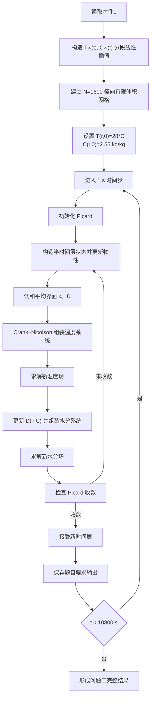

# A题问题二：与问题三统一的温度—水分双向耦合全流程数学模型

## 1. 问题定义

药材近似为长

$$
L=25\ \mathrm{cm}=0.25\ \mathrm m
$$

、半径

$$
R=2\ \mathrm{cm}=0.02\ \mathrm m
$$

的圆柱体。烘干初始时刻为

$$
T(r,0)=28^\circ\mathrm C,
\qquad
C(r,0)=2.55\ \mathrm{kg/kg}.
$$

问题二要求建立整个烘干过程中药材内部温度场

$$
T(r,t)
$$

和干基含水率场

$$
C(r,t)
$$

的变化模型，并统一使用附录 3 给出的状态相关经验公式。

问题二计算区间为

$$
0\le t\le10800\ \mathrm s=3\ \mathrm h,
\qquad
0\le r\le0.02\ \mathrm m.
$$

本问题二模型与问题三采用同一组控制方程、边界条件、物性关系、空间离散、时间离散和非线性求解方法。问题三仅在问题二基础上继续向后积分，并增加长期稳定环境边界及烘干终止判定。

---

## 2. 模型结构

| 模型环节   | 采用形式                 |
| ------ | -------------------- |
| 几何模型   | 固定半径圆柱一维径向模型         |
| 温度控制方程 | 变物性非稳态 Fourier 导热方程  |
| 水分控制方程 | 变扩散系数 Fick 扩散方程      |
| 中心边界   | 轴对称零通量条件             |
| 表面热边界  | Newton 对流换热 Robin 边界 |
| 表面水分边界 | 对流传质 Robin 边界        |
| 外部环境数据 | 附件 1 分段线性插值          |
| 空间离散   | 守恒型圆柱径向有限体积法         |
| 界面物性   | 调和平均                 |
| 时间离散   | Crank–Nicolson       |
| 非线性耦合  | Picard 迭代            |
| 线性系统   | 三对角线性方程组直接求解         |

---

## 3. 模型假设

1. 药材视为均匀、连续、各向同性的规则圆柱体。
2. 仅考虑径向温度和水分变化，忽略轴向和周向梯度。
3. 问题二中药材半径保持

$$
R=0.02\ \mathrm m
$$

不变，不考虑尺寸收缩。
4. 初始温度和初始干基含水率在整个径向上均匀分布。
5. 药材内部复杂孔隙结构和不同形态水分迁移统一由有效扩散系数 $D(T,C)$ 描述。
6. 密度、比热容、导热系数和水分扩散系数由局部当前状态决定。
7. 烘房环境在药材圆柱侧表面上均匀分布。
8. 表面对流换热系数和对流传质系数采用

$$
h=25\ \mathrm{W/(m^2\,K)},
$$

$$
h_m=8\times10^{-7}\ \mathrm{m/s}.
$$

9. 附件 1 中烘房水分浓度直接作为表面对流传质边界中的外部有效水分浓度 $C_\infty(t)$。
10. 不额外加入蒸发潜热、辐射换热、内部热源、化学反应和相变动力学。
11. 温度与水分之间的耦合通过状态相关物性参数实现。

---

## 4. 变量与参数

| 符号            | 含义          | 单位       |
| ------------- | ----------- | -------- |
| $r$           | 距圆柱中心轴的径向距离 | m        |
| $R$           | 药材半径        | m        |
| $L$           | 药材长度        | m        |
| $t$           | 时间          | s        |
| $T(r,t)$      | 药材内部温度      | °C       |
| $T_K(r,t)$    | 药材绝对温度      | K        |
| $C(r,t)$      | 药材干基含水率     | kg/kg    |
| $T_\infty(t)$ | 烘房温度        | °C       |
| $C_\infty(t)$ | 烘房水分浓度      | kg/kg    |
| $\rho(C)$     | 密度          | kg/m³    |
| $c_p(C)$      | 比热容         | J/(kg·K) |
| $k(C)$        | 导热系数        | W/(m·K)  |
| $D(T,C)$      | 有效水分扩散系数    | m²/s     |
| $h$           | 对流换热系数      | W/(m²·K) |
| $h_m$         | 对流传质系数      | m/s      |

---

## 5. 烘房环境边界数据

附件 1 给出 $0\sim14400\ \mathrm s$ 内的烘房温度和水分浓度。问题二的 $0\sim10800\ \mathrm s$ 全部位于附件 1 数据范围内，因此直接对附件 1 数据进行分段线性插值。

对任一环境变量 $y(t)$，相邻数据点为

$$
(t_j,y_j),\qquad(t_{j+1},y_{j+1}),
$$

则

$$
y(t)=y_j+
\frac{y_{j+1}-y_j}{t_{j+1}-t_j}(t-t_j),
\qquad t_j\le t\le t_{j+1}.
$$

由此得到

$$
T_\infty(t),\qquad C_\infty(t).
$$

Crank–Nicolson 时间推进中使用半时间层环境值

$$
T_\infty(t_{n+1/2}),
\qquad
C_\infty(t_{n+1/2}).
$$

问题三在 $t>14400\ \mathrm s$ 后继续采用稳定阶段平均边界；该延拓不参与问题二前三小时的计算。

---

## 6. 附录 3 状态相关物性

密度为

$$
\rho(C)=650+128C.
$$

比热容为

$$
c_p(C)=1450+2736\frac{C}{C+1}.
$$

导热系数为

$$
k(C)=0.21+0.38\frac{C}{C+1}.
$$

水分扩散系数为

$$
D(T,C)=2.4\times10^{-3}
\exp\left(-\frac{0.45}{C}\right)
\exp\left(-\frac{3850}{T_K}\right).
$$

其中

$$
T_K=T+273.15.
$$

状态耦合关系可写为

$$
C\rightarrow \rho(C),c_p(C),k(C)\rightarrow T,
$$

以及

$$
T,C\rightarrow D(T,C)\rightarrow C.
$$

---

## 7. 温度控制方程

在轴对称圆柱坐标系中，温度满足

$$
\rho(C)c_p(C)
\frac{\partial T}{\partial t}
=
\frac1r\frac{\partial}{\partial r}
\left[
rk(C)\frac{\partial T}{\partial r}
\right],
\qquad 0<r<R.
$$

---

## 8. 水分控制方程

干基含水率满足

$$
\frac{\partial C}{\partial t}
=
\frac1r\frac{\partial}{\partial r}
\left[
rD(T,C)\frac{\partial C}{\partial r}
\right],
\qquad 0<r<R.
$$

---

## 9. 初始条件

$$
T(r,0)=28^\circ\mathrm C,
$$

$$
C(r,0)=2.55\ \mathrm{kg/kg}.
$$

---

## 10. 中心轴边界条件

$$
\left.\frac{\partial T}{\partial r}\right|_{r=0}=0,
$$

$$
\left.\frac{\partial C}{\partial r}\right|_{r=0}=0.
$$

---

## 11. 表面对流边界条件

### 11.1 温度边界

在 $r=R$ 处

$$
-k(C_s)
\left.\frac{\partial T}{\partial r}\right|_{r=R}
=
h[T_s-T_\infty(t)].
$$

### 11.2 水分边界

在 $r=R$ 处

$$
-D(T_s,C_s)
\left.\frac{\partial C}{\partial r}\right|_{r=R}
=
h_m[C_s-C_\infty(t)].
$$

其中

$$
T_s=T(R,t),\qquad C_s=C(R,t).
$$

---

## 12. 空间离散：守恒型径向有限体积法

### 12.1 径向网格

将

$$
0\le r\le R
$$

划分为 $N$ 个等长区间：

$$
\Delta r=\frac RN,
\qquad
r_i=i\Delta r,
\qquad i=0,1,\ldots,N.
$$

与问题三统一，最终精细计算采用

$$
\boxed{N=1600}
$$

因此

$$
\boxed{
\Delta r=1.25\times10^{-5}\ \mathrm m
=0.00125\ \mathrm{cm}
}.
$$

题目要求的 $0,0.1,0.2,\ldots,2.0\ \mathrm{cm}$ 输出位置均精确落在计算节点上。

### 12.2 控制体几何量

节点面定义为

$$
r_{i+1/2}=\frac{r_i+r_{i+1}}2.
$$

约去公共因子 $2\pi L$ 后，第 $i$ 个控制体积对应的径向几何测度为

$$
V_i^{(r)}=
\frac{r_{i+1/2}^2-r_{i-1/2}^2}{2}.
$$

中心节点与表面节点采用半控制体积。中心内侧面的半径为 0，因此中心零通量条件可直接进入守恒离散。

---

## 13. 界面物性：调和平均

导热系数采用

$$
k_{i+1/2}
=
\frac{2k_i k_{i+1}}{k_i+k_{i+1}}.
$$

扩散系数采用

$$
D_{i+1/2}
=
\frac{2D_i D_{i+1}}{D_i+D_{i+1}}.
$$

对应界面通量系数为

$$
G^T_{i+1/2}
=
\frac{r_{i+1/2}k_{i+1/2}}{\Delta r},
$$

$$
G^C_{i+1/2}
=
\frac{r_{i+1/2}D_{i+1/2}}{\Delta r}.
$$

---

## 14. 时间离散：Crank–Nicolson

与问题三统一，问题二采用 Crank–Nicolson 时间格式。

记

$$
t_{n+1}=t_n+\Delta t.
$$

对于当前 Picard 迭代，构造半时间层状态

$$
T_i^{n+1/2,(m)}
=
\frac{T_i^n+T_i^{n+1,(m)}}2,
$$

$$
C_i^{n+1/2,(m)}
=
\frac{C_i^n+C_i^{n+1,(m)}}2.
$$

温度离散形式为

$$
\rho_i^{(m)}c_{p,i}^{(m)}V_i^{(r)}
\frac{T_i^{n+1}-T_i^n}{\Delta t}
=
\frac12
\left[
\mathcal L_T^{(m)}(T^{n+1})_i
+
\mathcal L_T^{(m)}(T^n)_i
\right].
$$

水分离散形式为

$$
V_i^{(r)}
\frac{C_i^{n+1}-C_i^n}{\Delta t}
=
\frac12
\left[
\mathcal L_C^{(m)}(C^{n+1})_i
+
\mathcal L_C^{(m)}(C^n)_i
\right].
$$

其中

$$
\mathcal L_T(T)_i
=
G^T_{i+1/2}(T_{i+1}-T_i)
-
G^T_{i-1/2}(T_i-T_{i-1}),
$$

$$
\mathcal L_C(C)_i
=
G^C_{i+1/2}(C_{i+1}-C_i)
-
G^C_{i-1/2}(C_i-C_{i-1}).
$$

表面控制体的外侧通量由 Robin 边界直接代入。

---

## 15. 时间步设置

问题二全部处于问题三统一模型的前 4 h 阶段，因此固定采用

$$
\boxed{\Delta t=1\ \mathrm s}.
$$

这与题目要求的 `result2.xlsx` 每 1 s 输出完全一致，不需要时间插值。

问题三继续积分时，在 $t>14400\ \mathrm s$ 后改用 $10\ \mathrm s$ 时间步；该设置不影响问题二前三小时结果。

---

## 16. 非线性耦合求解：Picard 迭代

已知时间层 $T^n,C^n$，取

$$
T^{n+1,(0)}=T^n,
\qquad
C^{n+1,(0)}=C^n.
$$

第 $m$ 轮迭代执行：

1. 构造半时间层状态

$$
T^{n+1/2,(m)},\qquad C^{n+1/2,(m)}.
$$

2. 根据当前水分状态更新

$$
\rho(C),\qquad c_p(C),\qquad k(C).
$$

3. 对界面 $k$ 采用调和平均，组装并求解温度三对角系统，得到

$$
T^{n+1,(m+1)}.
$$

4. 将温度换算为 Kelvin，根据当前温度和水分状态更新

$$
D(T,C).
$$

5. 对界面 $D$ 采用调和平均，组装并求解水分三对角系统，得到

$$
C^{n+1,(m+1)}.
$$

6. 计算

$$
E_T^{(m+1)}
=
\max_i
\left|
T_i^{n+1,(m+1)}-T_i^{n+1,(m)}
\right|,
$$

$$
E_C^{(m+1)}
=
\max_i
\left|
C_i^{n+1,(m+1)}-C_i^{n+1,(m)}
\right|.
$$

当同时满足

$$
E_T\le10^{-8}\ ^\circ\mathrm C,
$$

$$
E_C\le10^{-10}\ \mathrm{kg/kg}
$$

时接受该时间层，否则继续 Picard 迭代。

---

## 17. 三对角线性系统

有限体积离散后，每个节点只与 $i-1,i,i+1$ 三个节点相邻，因此温度和水分方程分别形成

$$
A_T\mathbf T^{n+1}=\mathbf b_T,
$$

$$
A_C\mathbf C^{n+1}=\mathbf b_C,
$$

其中 $A_T,A_C$ 均为三对角矩阵，可采用 Thomas 算法或标准三对角直接求解器求解。

---

## 18. 完整计算流程

---

## 19. 基准计算参数

| 项目              | 数值                                                  |
| --------------- | ---------------------------------------------------:|
| 半径 $R$          | $0.02\ \mathrm m$                                   |
| 长度 $L$          | $0.25\ \mathrm m$                                   |
| 径向区间数 $N$       | 1600                                                |
| 径向步长 $\Delta r$ | $1.25\times10^{-5}\ \mathrm m=0.00125\ \mathrm{cm}$ |
| 时间步长 $\Delta t$ | $1\ \mathrm s$                                      |
| 计算时间范围          | $0\sim10800\ \mathrm s$                             |
| 空间离散            | 守恒型有限体积                                             |
| 时间离散            | Crank–Nicolson                                      |
| 界面物性            | 调和平均                                                |
| 非线性迭代           | Picard                                              |
| 温度收敛阈值          | $10^{-8}\ ^\circ\mathrm C$                          |
| 水分收敛阈值          | $10^{-10}\ \mathrm{kg/kg}$                          |

---

## 20. 初始状态下的特征量

在

$$
C_0=2.55,
\qquad
T_0=28^\circ\mathrm C=301.15\ \mathrm K
$$

时：

$$
\rho_0=650+128\times2.55=976.4\ \mathrm{kg/m^3}.
$$

$$
c_{p,0}
=1450+2736\frac{2.55}{3.55}
\approx3415.30\ \mathrm{J/(kg\,K)}.
$$

$$
k_0
=0.21+0.38\frac{2.55}{3.55}
\approx0.48296\ \mathrm{W/(m\,K)}.
$$

$$
D_0
=2.4\times10^{-3}
e^{-0.45/2.55}
e^{-3850/301.15}
\approx5.64\times10^{-9}\ \mathrm{m^2/s}.
$$

对应热扩散率约为

$$
\alpha_0
=\frac{k_0}{\rho_0c_{p,0}}
\approx1.45\times10^{-7}\ \mathrm{m^2/s}.
$$

---

## 21. 数值验证

### 21.1 Picard 收敛检查

逐时间步记录 $E_T,E_C$ 和实际迭代次数，所有接受时间层均需满足预设收敛阈值。

### 21.2 空间网格检查

与问题三统一采用逐级加密：

$$
N=400\rightarrow800\rightarrow1600.
$$

比较问题二表 3、表 4 指定时空位置的温度和水分浓度，并确认随网格加密结果趋于稳定。

### 21.3 时间步检查

以

$$
\Delta t=1\ \mathrm s
$$

为基准，并以

$$
\Delta t=0.5\ \mathrm s
$$

进行时间步减半校核，比较表 3、表 4 关键位置结果。

### 21.4 基本物理与数值检查

至少检查：

1. $T,C$ 不存在 NaN 或 Inf；
2. $C$ 不出现明显负值；
3. 中心零通量条件正确；
4. 表面热通量符号与 $T_\infty-T_s$ 一致；
5. 表面水分通量符号与 $C_s-C_\infty$ 一致；
6. 径向场无明显数值振荡；
7. 问题三重新计算的 $0\sim3\ \mathrm h$ 状态必须与本问题二结果保持一致。

---

## 22. 结果输出结构

### 22.1 表 3 温度

提取时间

$$
t=0.5,1.0,1.5,2.0,2.5,3.0\ \mathrm h
$$

和径向位置

$$
r=0,0.5,1.0,1.5,2.0\ \mathrm{cm}
$$

处的温度。

### 22.2 表 4 水分浓度

在相同时间和径向位置提取

$$
C(r,t).
$$

### 22.3 `result2.xlsx`

完整输出采用：

时间：

$$
0,1,2,\ldots,10800\ \mathrm s.
$$

径向距离：

$$
0,0.1,0.2,\ldots,2.0\ \mathrm{cm}.
$$

工作表结构：

- `温度`
- `水分浓度`

A 列保存时间，单位 s；第一行保存到药材中心的距离，单位 cm。

由于内部时间步为 $1\ \mathrm s$，所有题目要求时间点均直接落在求解时间层；由于 $\Delta r=0.00125\ \mathrm{cm}$，所有 $0.1\ \mathrm{cm}$ 输出位置均精确落在计算节点上。

---

## 23. 与问题三的连续关系

问题三不重新定义问题二模型，而是直接使用本文模型从 $t=0$ 向后连续推进。

因此问题二和问题三共用：

- 相同固定半径几何；
- 相同附录 3 状态相关物性；
- 相同温度和水分 PDE；
- 相同中心与表面边界；
- 相同有限体积空间离散；
- 相同界面调和平均；
- 相同 Crank–Nicolson 时间离散；
- 相同 Picard 非线性耦合；
- 相同 $N=1600$ 精细网格。

问题三只在两个方面进行扩展：

1. $t>14400\ \mathrm s$ 后使用稳定阶段平均烘房边界；
2. 连续积分直到

$$
\max_{0\le r\le R} C(r,t)<0.15\ \mathrm{kg/kg}.
$$

因此，问题三前 3 h 的状态必须与问题二结果完全一致。

---

## 24. 数学模型汇总

最终连续模型为

$$
\boxed{
\rho(C)c_p(C)
\frac{\partial T}{\partial t}
=
\frac1r\frac{\partial}{\partial r}
\left[
rk(C)\frac{\partial T}{\partial r}
\right]
}
$$

和

$$
\boxed{
\frac{\partial C}{\partial t}
=
\frac1r\frac{\partial}{\partial r}
\left[
rD(T,C)\frac{\partial C}{\partial r}
\right]
}.
$$

其中

$$
\rho=650+128C,
$$

$$
c_p=1450+2736\frac{C}{C+1},
$$

$$
k=0.21+0.38\frac{C}{C+1},
$$

$$
D=2.4\times10^{-3}
\exp\left(-\frac{0.45}{C}\right)
\exp\left(-\frac{3850}{T+273.15}\right).
$$

数值离散统一采用

$$
\boxed{
\text{径向守恒 FVM}
+
\text{界面调和平均}
+
\text{Crank--Nicolson}
+
\text{Picard}
}
$$

问题二基准参数统一为

$$
\boxed{
N=1600,
\qquad
\Delta r=0.00125\ \mathrm{cm},
\qquad
\Delta t=1\ \mathrm s.
}
$$
